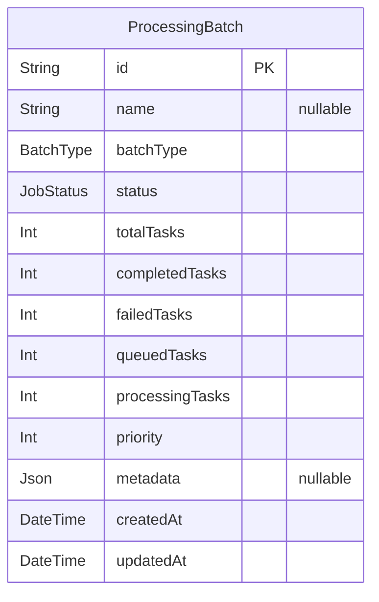
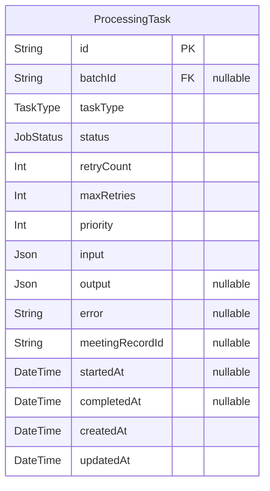
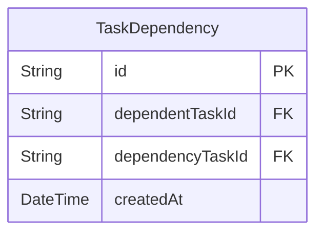
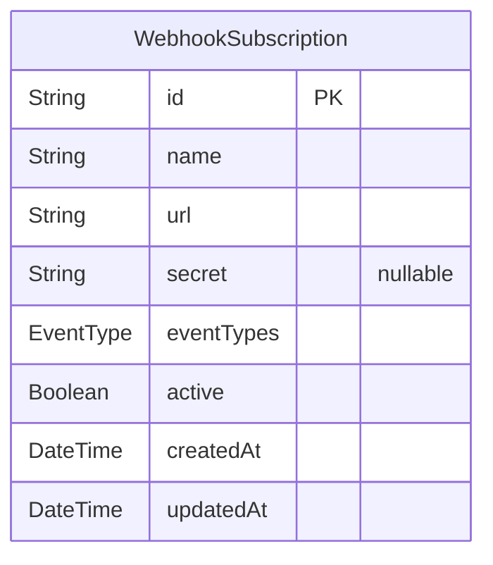
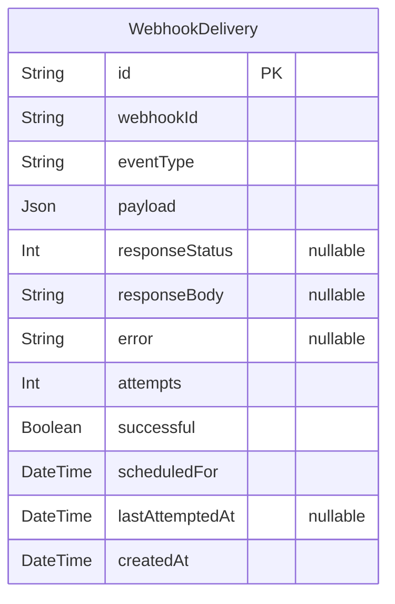

# Batch Service DB
> Generated by [`prisma-markdown`](https://github.com/samchon/prisma-markdown)

- [ProcessingBatch](#processingbatch)
- [ProcessingTask](#processingtask)
- [TaskDependency](#taskdependency)
- [WebhookSubscription](#webhooksubscription)
- [WebhookDelivery](#webhookdelivery)

## ProcessingBatch

### `ProcessingBatch`
Represents a batch of processing tasks

**Properties**
  - `id`: 
  - `name`: 
  - `batchType`: Type of batch (media, document, transcription, etc.)
  - `status`: queued, processing, completed, completed_with_errors, failed
  - `totalTasks`: 
  - `completedTasks`: 
  - `failedTasks`: 
  - `queuedTasks`: 
  - `processingTasks`: 
  - `priority`: 
  - `metadata`: [BatchMetadataJSON]
  - `createdAt`: 
  - `updatedAt`: 

## ProcessingTask

### `ProcessingTask`
Represents a single processing task within a batch

**Properties**
  - `id`: 
  - `batchId`: 
  - `taskType`: 
  - `status`: 
  - `retryCount`: 
  - `maxRetries`: 
  - `priority`: 
  - `input`: [TaskInputJSON]
  - `output`: [TaskOutputJSON]
  - `error`: 
  - `meetingRecordId`: 
  - `startedAt`: 
  - `completedAt`: 
  - `createdAt`: 
  - `updatedAt`: 

## TaskDependency

### `TaskDependency`
Represents a dependency between tasks

**Properties**
  - `id`: 
  - `dependentTaskId`: 
  - `dependencyTaskId`: 
  - `createdAt`: 

## WebhookSubscription

### `WebhookSubscription`
Represents a webhook endpoint for batch event notifications

**Properties**
  - `id`: 
  - `name`: 
  - `url`: 
  - `secret`: 
  - `eventTypes`: 
  - `active`: 
  - `createdAt`: 
  - `updatedAt`: 

## WebhookDelivery

### `WebhookDelivery`
Tracks the delivery of webhook notifications

**Properties**
  - `id`: 
  - `webhookId`: 
  - `eventType`: 
  - `payload`: [WebhookPayloadJSON]
  - `responseStatus`: 
  - `responseBody`: 
  - `error`: 
  - `attempts`: 
  - `successful`: 
  - `scheduledFor`: 
  - `lastAttemptedAt`: 
  - `createdAt`: 