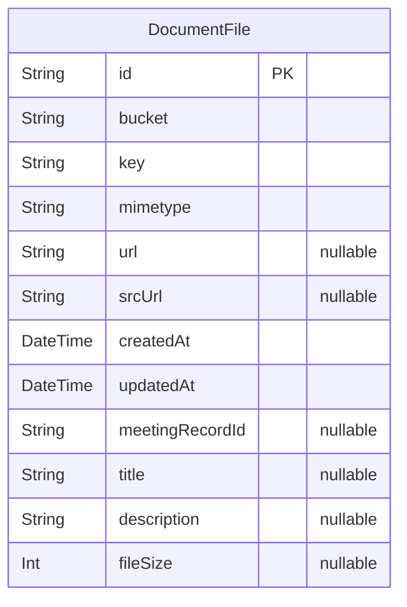

# Documents Service Database Schema
> Generated by [`prisma-markdown`](https://github.com/samchon/prisma-markdown)

- [default](#default)

## default

### `DocumentFile`

**Properties**
  - `id`: 
  - `bucket`: 
  - `key`: 
  - `mimetype`: 
  - `url`: 
  - `srcUrl`: 
  - `createdAt`: 
  - `updatedAt`: 
  - `meetingRecordId`: 
  - `title`: 
  - `description`: 
  - `fileSize`: 