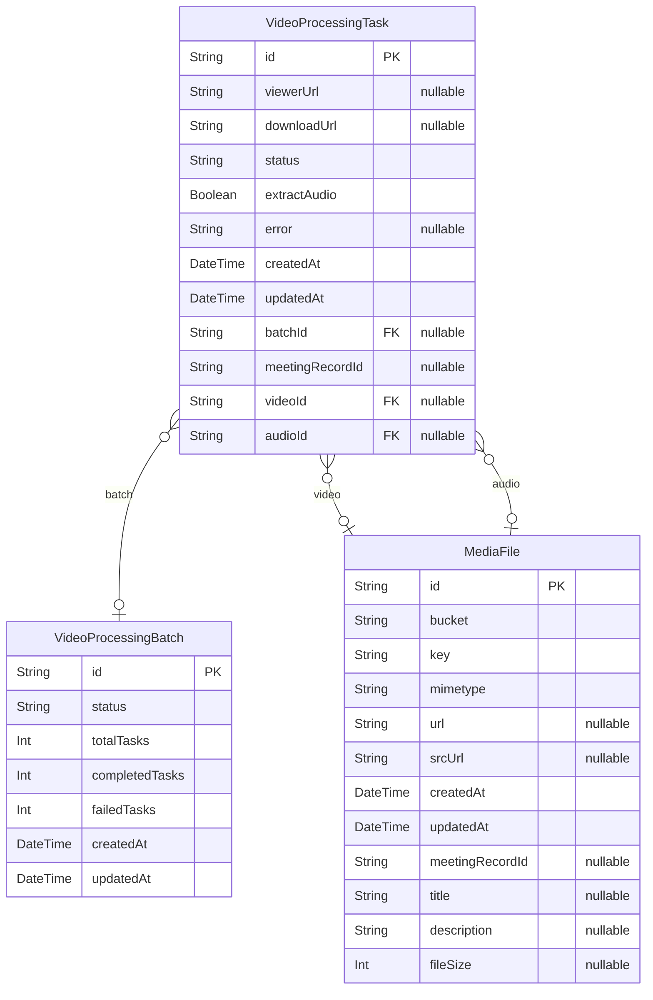

# Media Service Database Schema
> Generated by [`prisma-markdown`](https://github.com/samchon/prisma-markdown)

- [default](#default)

## default

### `MediaFile`

**Properties**
  - `id`: 
  - `bucket`: 
  - `key`: 
  - `mimetype`: 
  - `url`: 
  - `srcUrl`: 
  - `createdAt`: 
  - `updatedAt`: 
  - `meetingRecordId`: 
  - `title`: 
  - `description`: 
  - `fileSize`: 

### `VideoProcessingBatch`

**Properties**
  - `id`: 
  - `status`: 
  - `totalTasks`: 
  - `completedTasks`: 
  - `failedTasks`: 
  - `createdAt`: 
  - `updatedAt`: 

### `VideoProcessingTask`

**Properties**
  - `id`: 
  - `viewerUrl`: 
  - `downloadUrl`: 
  - `status`: 
  - `extractAudio`: 
  - `error`: 
  - `createdAt`: 
  - `updatedAt`: 
  - `batchId`: 
  - `meetingRecordId`: 
  - `videoId`: 
  - `audioId`: 