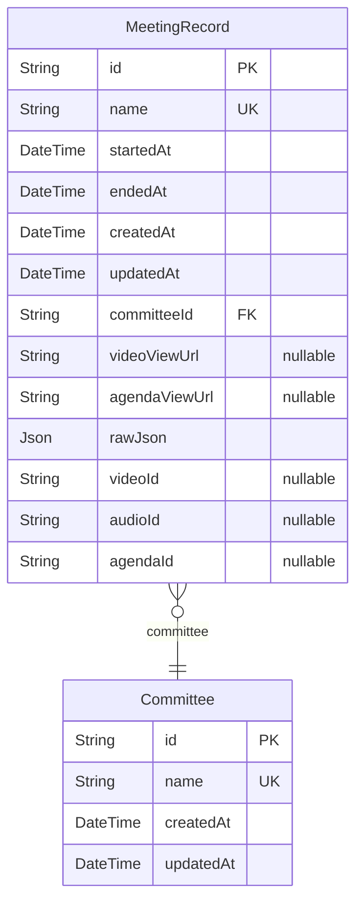

# Models
> Generated by [`prisma-markdown`](https://github.com/samchon/prisma-markdown)

- [default](#default)

## default

### `Committee`

**Properties**
  - `id`: 
  - `name`: 
  - `createdAt`: 
  - `updatedAt`: 

### `MeetingRecord`

**Properties**
  - `id`: 
  - `name`: 
  - `startedAt`: 
  - `endedAt`: 
  - `createdAt`: 
  - `updatedAt`: 
  - `committeeId`: 
  - `videoViewUrl`: 
  - `agendaViewUrl`: 
  - `rawJson`: [MeetingRawJSON]
  - `videoId`: 
  - `audioId`: 
  - `agendaId`: 