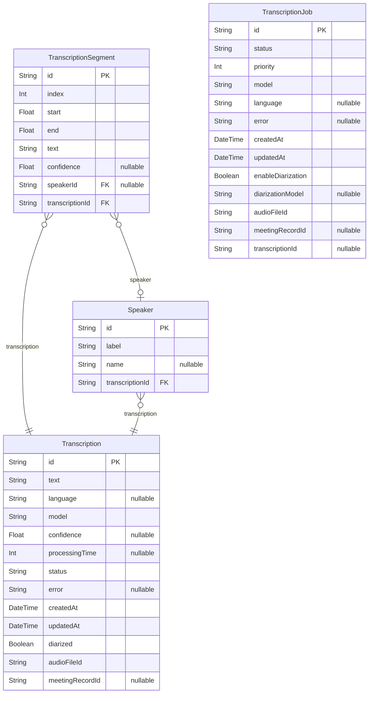

# Transcription Service Database Schema
> Generated by [`prisma-markdown`](https://github.com/samchon/prisma-markdown)

- [default](#default)

## default

### `Transcription`

**Properties**
  - `id`: 
  - `text`: 
  - `language`: 
  - `model`: 
  - `confidence`: 
  - `processingTime`: 
  - `status`: 
  - `error`: 
  - `createdAt`: 
  - `updatedAt`: 
  - `diarized`: 
  - `audioFileId`: 
  - `meetingRecordId`: 

### `TranscriptionSegment`

**Properties**
  - `id`: 
  - `index`: 
  - `start`: 
  - `end`: 
  - `text`: 
  - `confidence`: 
  - `speakerId`: 
  - `transcriptionId`: 

### `Speaker`

**Properties**
  - `id`: 
  - `label`: 
  - `name`: 
  - `transcriptionId`: 

### `TranscriptionJob`

**Properties**
  - `id`: 
  - `status`: 
  - `priority`: 
  - `model`: 
  - `language`: 
  - `error`: 
  - `createdAt`: 
  - `updatedAt`: 
  - `enableDiarization`: 
  - `diarizationModel`: 
  - `audioFileId`: 
  - `meetingRecordId`: 
  - `transcriptionId`: 